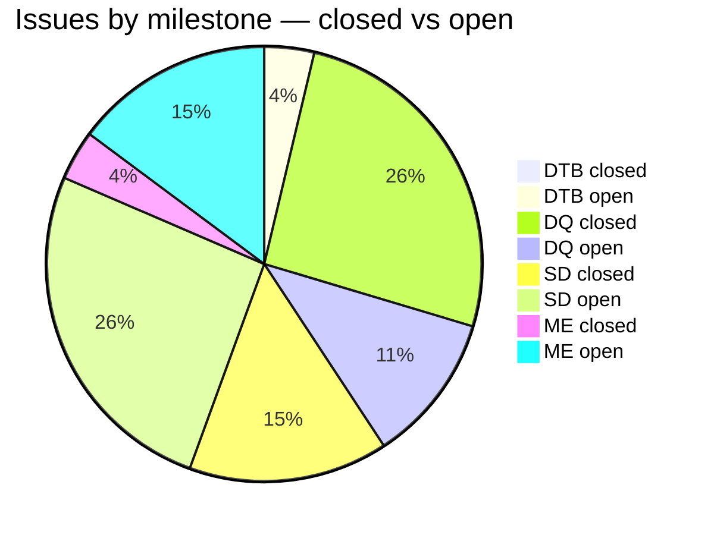
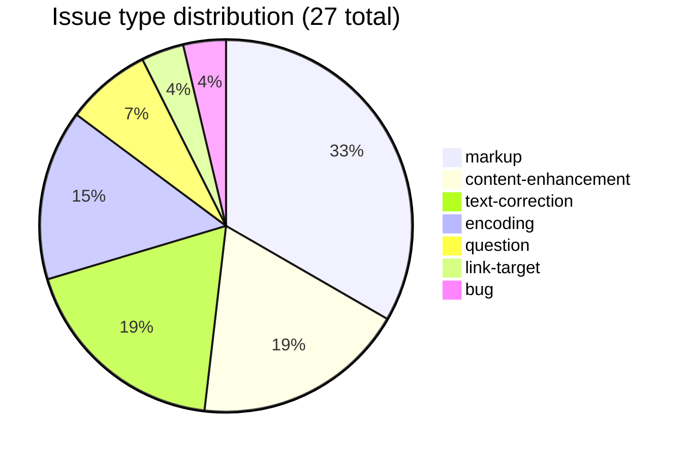

# AP90

Research and correction work on **Apte's Sanskrit-English Dictionary of 1890**, part of the [sanskrit-lexicon](https://github.com/sanskrit-lexicon) project.

## Contents

| Directory | Description |
|---|---|
| `verbs01/` | Verb identification and correlation with MW dictionary |
| `ap57_verbs01/` | Same pipeline for the smaller Apte AP57 |
| `markup/abls/` | Literary source (`<ls>`) abbreviation markup — round 1 |
| `markup/abls1/` | Further `<ls>` markup corrections — round 2 |
| `markup/hyphen_deva/` | Devanagari hyphenation fixes |
| `markup/hyphen_eng/` | English hyphenation fixes |
| `markup/ap57_90_ls/` | AP57 vs AP90 literary source comparison |
| `apte_s2h/` | Apte abbreviation transcoding (SLP1 → IAST/Devanagari) |
| `andhrabharati/` | Andhra Bharati cross-reference for abbreviations |
| `compounds/AB_AP57/` | AP57 compound entry parsing |
| `issues/` | Per-issue correction workflows |

## Timeline

| Year | Work |
|---|---|
| 2020 | Verb identification (`verbs01/`): 3,632 AP90 verb entries mapped to MW |
| 2020–2021 | Literary source markup pipeline (`markup/abls/`), 5-step `prep*.py` chain |
| 2021 | Round 2 markup corrections (`markup/abls1/`) via filter scripts |
| 2021 | Devanagari and English hyphenation fixes (`markup/hyphen_*`) |
| 2022 | Andhra Bharati abbreviation cross-reference (`andhrabharati/`) |
| 2022–2025 | Text corrections, encoding fixes, ongoing markup issues |

## Projects & Milestones

| Milestone | Project | Total | Open | Closed |
|---|---|---|---|---|
| Dictionary to Book (1) | Project 1 | 1 | 1 | 0 |
| Digitization Quality (2) | Project 2 | 10 | 3 | 7 |
| Structured Data (3) | Project 3 | 11 | 7 | 4 |
| Major Enhancements (4) | Project 4 | 5 | 4 | 1 |
| **Total** | | **27** | **15** | **12** |

## Issue Typology

### Solved (12 closed)

| # | Type | Severity | Summary |
|---|---|---|---|
| #4 | markup | medium | `<ls>` markup batch corrections |
| #5 | content-enhancement | minor | Display upgrade |
| #7 | encoding | minor | Character rendering fix |
| #8 | encoding | minor | Character rendering fix |
| #9 | markup | minor | XML tag normalisation |
| #13 | encoding | minor | SLP1 transcoding fix |
| #18 | text-correction | minor | German/English definition correction |
| #19 | markup | minor | XML tag normalisation |
| #20 | text-correction | minor | Definition correction |
| #22 | encoding | minor | Character rendering fix |
| #24 | markup | medium | `<ls>` markup batch corrections |
| #25 | text-correction | minor | Definition correction |

### Open (15 open)

| # | Type | Severity | Summary |
|---|---|---|---|
| #1 | content-enhancement | medium | Verb markup integration |
| #2 | content-enhancement | medium | Bibliography enhancements |
| #3 | content-enhancement | minor | Display upgrade |
| #6 | bug | minor | Broken link or XML error |
| #11 | markup | medium | `<ls>` markup corrections |
| #12 | link-target | medium | `<ls>` click-through to PDF pages |
| #14 | markup | minor | XML tag normalisation |
| #15 | markup | minor | XML tag normalisation |
| #16 | markup | minor | XML tag normalisation |
| #17 | content-enhancement | medium | Major display upgrade |
| #21 | text-correction | minor | Definition correction |
| #23 | markup | medium | `<ls>` markup batch corrections |
| #26 | text-correction | medium | Batch definition corrections |
| #27 | question | minor | Editorial question |
| #28 | question | minor | Editorial question |

## Labels

**Type** (one per issue): `link-target` · `link-splitting` · `markup` · `text-correction` · `content-enhancement` · `encoding` · `scan-quality` · `bug` · `question`

**Severity** (one per issue): `minor` · `medium` · `hard`

## Contributors

[sanskrit-lexicon](https://github.com/sanskrit-lexicon) project.
